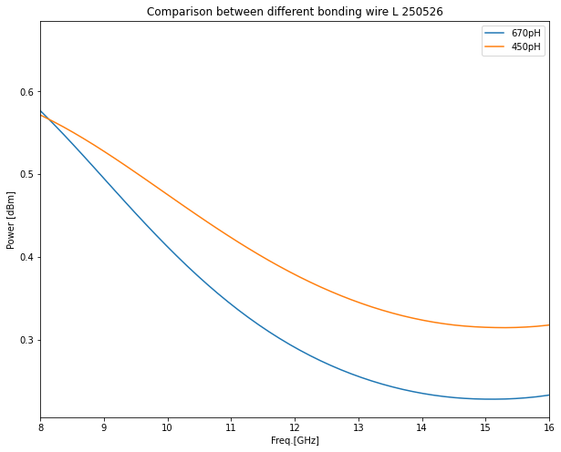
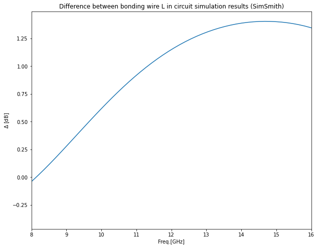
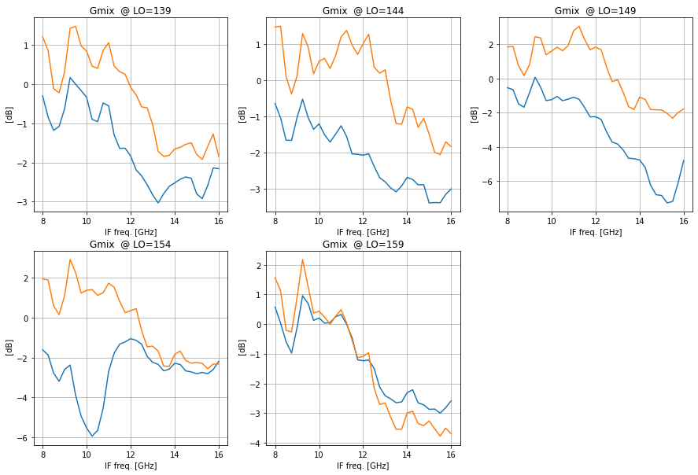
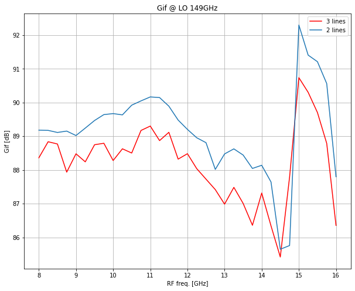
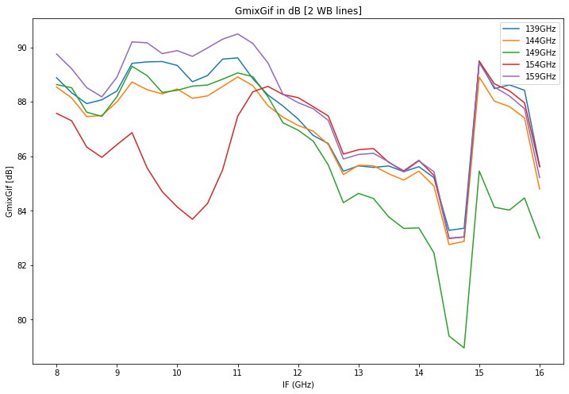

Wire bonding L calculation and predict the result

## 1. Capacitance Estimation

We model the Nb film on quartz and vacuum as a series capacitor:

$$
\frac{1}{C_{\text{total}}} = \frac{1}{C_{\text{quartz}}} + \frac{1}{C_{\text{vacuum}}}
$$

Each layer:

$$
C = \varepsilon_0 \varepsilon_r \frac{A}{d}
$$

**Where:**

- $\varepsilon_0 = 8.854 \times 10^{-12} \,\text{F/m}$
- $A = 430~\mu\text{m} \times 182.5~\mu\text{m} = 7.8475 \times 10^{-8} \,\text{m}^2$
- $\varepsilon_{r,\text{quartz}} \approx 3.78$
- $\varepsilon_{r,\text{vacuum}} = 1$
- $d = 100~\mu\text{m} = 1.0 \times 10^{-4} \,\text{m}$

**From these values:**

- $C_{\text{quartz}} \approx 26.2~\text{fF}$
- $C_{\text{vacuum}} \approx 6.95~\text{fF}$
- $C_{\text{total}} \approx 5.4~\text{fF}$

---

## 2. Resonant Frequency

The resonance frequency with inductance $L$ and capacitance $C$ is:

$$
f_0 = \frac{1}{2\pi \sqrt{LC}}
$$

Example:

- $L = 2.0~\text{nH}$, $C = 5.4~\text{fF}$ $\Rightarrow$ $f_0 \approx 48.4~\text{GHz}$

---

## 3. Frequency vs Inductance Table

| $L$ (nH) | $f_0$ (GHz) |
|---------:|------------:|
| 0.1      | 152.68      |
| 0.5      | 68.25       |
| 1.0      | 48.25       |
| 1.5      | 39.37       |
| 2.0      | 34.12       |


```python
import matplotlib.pyplot as plt
import pandas as pd
import numpy as np
from scipy.optimize import curve_fit
import scipy.constants as sc
from itertools import combinations
```


```python
#dir='./150_mixer/data/'
#dir1='./150_mixer/data/250506-08/'
dir1='/Users/kangjm/OneDriveUST/Lab_research/Experiment/New50OhmPCB/'
date='250526'
```


```python
l670=pd.read_csv(dir1+"typeB_L670pH.dat",sep='\s+',skiprows=1,names=["freq","real","imag","p"])
l450=pd.read_csv(dir1+"typeB_L450pH.dat",sep='\s+',header=None,skiprows=1,names=["freq","real","imag","p"])

fig, ax1 = plt.subplots(figsize=(10,8))
#plt.plot(l670.freq/1e3,10*np.log10(l670.p/l670.p.max()),'-',label='670pH')
#plt.plot(l450.freq/1e3,10*np.log10(l450.p/l450.p.max()),'-',label='450pH')
#plt.plot(l670.freq/1e3,(l670.p/l670.p.max()),'-',label='670pH')
#plt.plot(l450.freq/1e3,(l450.p/l450.p.max()),'-',label='450pH')
plt.plot(l670.freq/1e3,(l670.p),'-',label='670pH')
plt.plot(l450.freq/1e3,(l450.p),'-',label='450pH')

#plt.vlines(10.2,0,400,color='blue',linestyle='--')
#plt.plot(piv_2.V,piv_2.I,'-',label='Pumped 64uA')
#plt.vlines(10.8,0,400,color='orange',linestyle='--')
plt.xlim(8,16)
plt.title('Comparison between different bonding wire L '+date)
plt.xlabel('Freq.[GHz]')
plt.ylabel('Power [dBm]')
plt.legend()
#fig.savefig(dir1+'ivcurves_'+date+'.png')
```


    <matplotlib.legend.Legend at 0x7f7d37374cd0>





```python
l670.freq
```


    0      4000.00
    1      4161.62
    2      4323.23
    3      4484.85
    4      4646.46
            ...   
    95    19353.50
    96    19515.20
    97    19676.80
    98    19838.40
    99    20000.00
    Name: freq, Length: 100, dtype: float64


```python
fig, ax1 = plt.subplots(figsize=(10,8))
#plt.plot(l670.freq/1e3,l450.p-l670.p,'-',label='diff')
#plt.plot(l670.freq/1e3,10*np.log10(l450.p/l450.p.max()) - 10*np.log10(l670.p/l670.p.max()))
plt.plot(l670.freq/1e3,10*np.log10(l450.p) - 10*np.log10(l670.p))
#plt.plot(l670.freq/1e3,l450.p/l450.p.max() - l670.p/l670.p.max())
plt.title('Difference between bonding wire L in circuit simulation results (SimSmith)')#+date)
plt.xlim(8,16)
plt.xlabel('Freq.[GHz]')
plt.ylabel(r'$\Delta$ [dB]')
#plt.legend()
#fig.savefig(dir1+'ivcurves_'+date+'.png')
```


    Text(0, 0.5, '$\\Delta$ [dB]')





```python
dir2='./150_mixer/data/250515/'
date2='250515'
a=pd.read_csv(dir2+'Cal_results_'+date2+'.txt')
```


```python
dir3='./150_mixer/data/250506-08/'
date3='250506'
#dir3='./150_mixer/data/250430/'
#date3='250430'
#dir3='./150_mixer/data/250424-27/'
#date3='250427'
b=pd.read_csv(dir3+'Cal_results_'+date3+'.txt')
```


```python
a
```


<div>
<style scoped>
    .dataframe tbody tr th:only-of-type {
        vertical-align: middle;
    }

    .dataframe tbody tr th {
        vertical-align: top;
    }

    .dataframe thead th {
        text-align: right;
    }
</style>
<table border="1" class="dataframe">
  <thead>
    <tr style="text-align: right;">
      <th></th>
      <th>fIF</th>
      <th>P_hot</th>
      <th>P_cold</th>
      <th>trx</th>
      <th>fLO</th>
      <th>F_IF</th>
      <th>Gif</th>
      <th>Tif</th>
      <th>gmix</th>
      <th>tmix</th>
    </tr>
  </thead>
  <tbody>
    <tr>
      <th>0</th>
      <td>8.00</td>
      <td>173.9075</td>
      <td>65.6542</td>
      <td>52.3065</td>
      <td>139</td>
      <td>8.00</td>
      <td>6.854649e+08</td>
      <td>9.955163</td>
      <td>1.322748</td>
      <td>44.780377</td>
    </tr>
    <tr>
      <th>1</th>
      <td>8.25</td>
      <td>181.9769</td>
      <td>70.6911</td>
      <td>58.5186</td>
      <td>139</td>
      <td>8.25</td>
      <td>7.649105e+08</td>
      <td>11.145767</td>
      <td>1.218569</td>
      <td>49.372000</td>
    </tr>
    <tr>
      <th>2</th>
      <td>8.50</td>
      <td>142.8296</td>
      <td>55.2567</td>
      <td>57.6015</td>
      <td>139</td>
      <td>8.50</td>
      <td>7.533284e+08</td>
      <td>12.123715</td>
      <td>0.973658</td>
      <td>45.149786</td>
    </tr>
    <tr>
      <th>3</th>
      <td>8.75</td>
      <td>114.3987</td>
      <td>43.8447</td>
      <td>55.5380</td>
      <td>139</td>
      <td>8.75</td>
      <td>6.215812e+08</td>
      <td>12.370976</td>
      <td>0.950703</td>
      <td>42.525552</td>
    </tr>
    <tr>
      <th>4</th>
      <td>9.00</td>
      <td>146.8652</td>
      <td>56.3924</td>
      <td>55.9429</td>
      <td>139</td>
      <td>9.00</td>
      <td>7.045015e+08</td>
      <td>10.506982</td>
      <td>1.075616</td>
      <td>46.174564</td>
    </tr>
    <tr>
      <th>...</th>
      <td>...</td>
      <td>...</td>
      <td>...</td>
      <td>...</td>
      <td>...</td>
      <td>...</td>
      <td>...</td>
      <td>...</td>
      <td>...</td>
      <td>...</td>
    </tr>
    <tr>
      <th>160</th>
      <td>15.00</td>
      <td>111.4668</td>
      <td>44.7498</td>
      <td>66.1971</td>
      <td>159</td>
      <td>15.00</td>
      <td>1.184867e+09</td>
      <td>8.568599</td>
      <td>0.471616</td>
      <td>48.028508</td>
    </tr>
    <tr>
      <th>161</th>
      <td>15.25</td>
      <td>95.9007</td>
      <td>39.0381</td>
      <td>69.6118</td>
      <td>159</td>
      <td>15.25</td>
      <td>1.072003e+09</td>
      <td>9.550895</td>
      <td>0.444275</td>
      <td>48.114091</td>
    </tr>
    <tr>
      <th>162</th>
      <td>15.50</td>
      <td>79.2305</td>
      <td>32.4771</td>
      <td>71.3654</td>
      <td>159</td>
      <td>15.50</td>
      <td>9.338648e+08</td>
      <td>10.048273</td>
      <td>0.419325</td>
      <td>47.402430</td>
    </tr>
    <tr>
      <th>163</th>
      <td>15.75</td>
      <td>68.1360</td>
      <td>27.8430</td>
      <td>70.5801</td>
      <td>159</td>
      <td>15.75</td>
      <td>7.562807e+08</td>
      <td>11.534319</td>
      <td>0.446239</td>
      <td>44.732273</td>
    </tr>
    <tr>
      <th>164</th>
      <td>16.00</td>
      <td>38.5788</td>
      <td>16.5814</td>
      <td>84.1516</td>
      <td>159</td>
      <td>16.00</td>
      <td>4.319734e+08</td>
      <td>13.963652</td>
      <td>0.426516</td>
      <td>51.412757</td>
    </tr>
  </tbody>
</table>
<p>165 rows × 10 columns</p>
</div>


```python
k=1
plt.figure(figsize=(15,10))
for i in a.fLO.unique():
    aa=a.loc[a.fLO == i]
    bb=b.loc[b.fLO == i]
    plt.subplot(2,3,k)
    
    #plt.plot(aa.fIF, (bb.gmix-aa.gmix))
    plt.plot(aa.fIF, 10*np.log10(bb.gmix))
    plt.plot(aa.fIF, 10*np.log10(aa.gmix))
    #plt.plot(aa.fIF, 10**(aa.gmix/10)-10**(bb.gmix/10))
    plt.title('Gmix  @ LO='+str(i))
    plt.xlabel('IF freq. [GHz]')
    plt.ylabel(' [dB]')
    #plt.ylim(-8,3)
    plt.grid(True)
    k+=1
#plt.title('250416-17')
#plt.savefig(dir1+'Gmix_'+date+'_LO.png')
#plt.show()
```





```python
k=1
plt.figure(figsize=(15,10))
for i in a.fLO.unique():
    aa=a.loc[a.fLO == i]
    bb=b.loc[b.fLO == i]
    plt.subplot(2,3,k)
    
    #plt.plot(aa.fIF, (bb.gmix-aa.gmix))
    plt.plot(aa.fIF, 10*np.log10(bb.gmix)-10*np.log10(aa.gmix))
    #plt.plot(aa.fIF, 10**(aa.gmix/10)-10**(bb.gmix/10))
    plt.title('Gmix Difference @ LO='+str(i))
    plt.xlabel('IF freq. [GHz]')
    plt.ylabel('Difference [dB]')
    #plt.ylim(-8,3)
    plt.grid(True)
    k+=1
#plt.title('250416-17')
#plt.savefig(dir1+'Gmix_'+date+'_LO.png')
#plt.show()
```


```python
plt.figure(figsize=(10,8))

colors = plt.cm.tab10.colors  # 컬러맵에서 색상 선택 (10가지 색 순환 가능)

for idx, i in enumerate([149]):#a.fLO.unique()):
    aa = a.loc[a.fLO == i]
    bb = b.loc[a.fLO == i]
    color = colors[idx % len(colors)]  # 색상 순환

    plt.plot(aa.fIF , 10 * np.log10(aa.Gif), color='red',label='3 lines')
    #plt.plot(-aa.fIF + aa.fLO, 10 * np.log10(aa.Gif), color=color)
    plt.plot(bb.fIF , 10 * np.log10(bb.Gif), color=color,label='2 lines')
    #plt.plot(-bb.fIF + bb.fLO, 10 * np.log10(bb.Gif), color=color)
    plt.title('Gif @ LO '+str(i)+ 'GHz')
    plt.xlabel('RF freq. [GHz]')
    plt.ylabel('Gif [dB]')
    plt.legend()
    plt.grid(True)
#plt.ylim(-15, 10)

#plt.savefig(dir1+'Gmix_'+date+'.png')
```





```python
#dir3='./150_mixer/data/250506-08/'  => b 2lines
#dir2='./150_mixer/data/250515/'     => a 3lines
```


```python
fig = plt.subplots(figsize=(12,8))
for f in [139,144,149,154,159]: #a.fLO.unique():
    tmp=a.loc[(a.fLO == f)]
    plt.plot(tmp.fIF,10*np.log10(tmp.Gif*tmp.gmix),label=str(f)+'GHz')
plt.legend()
plt.xlabel('IF (GHz)')
plt.ylabel('GmixGif [dB]')
plt.title('GmixGif in dB [3 WB lines]')
plt.savefig(dir1+'GmixGif_3WB_'+date+'.png')
```


```python
fig = plt.subplots(figsize=(12,8))
for f in [139,144,149,154,159]: #a.fLO.unique():
    tmp=b.loc[(b.fLO == f)]
    plt.plot(tmp.fIF,10*np.log10(tmp.Gif*tmp.gmix),label=str(f)+'GHz')
plt.legend()
plt.xlabel('IF (GHz)')
plt.ylabel('GmixGif [dB]')
plt.title('GmixGif in dB [2 WB lines]')
plt.savefig(dir1+'GmixGif_2WB_'+date+'.png')
```





```python

```
